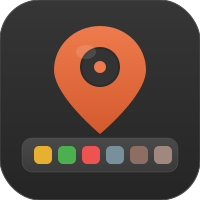

<p align="center">
  
</p>

<h1 align="center">DockPin</h1>

<p align="center">
  Pin your macOS Dock to a single display — no more Dock jumping between screens.
</p>

---

## Table of Contents / 目录

- [English Tutorial](#english-tutorial)
- [中文教程](#中文教程)

---

## English Tutorial

### What is DockPin?

DockPin is a lightweight command-line tool that pins your macOS Dock to one specific display. On multi-monitor setups, macOS moves the Dock to whichever screen you push your mouse to the bottom of. DockPin intercepts mouse events in real-time and prevents the Dock from activating on non-target displays — the cursor simply can't reach the Dock trigger zone on the wrong screen.

### How it works

DockPin uses a **CGEventTap** to intercept mouse movement events at the system level. When your cursor approaches the Dock activation edge (bottom/left/right) of a non-target display, DockPin clamps the cursor position a few pixels away from the edge. This prevents macOS from triggering the Dock on that screen. The Dock stays exactly where you want it.

### Prerequisites

1. **macOS 13 (Ventura) or later**
2. **Swift compiler** — comes with Xcode Command Line Tools. Install with:
   ```bash
   xcode-select --install
   ```
3. **Accessibility permission** — DockPin needs to intercept mouse events. Go to:
   **System Settings > Privacy & Security > Accessibility**, and enable your terminal app (e.g. Terminal, iTerm2, Warp).
4. **Screen Recording permission** (optional, for `status` command only) — Go to:
   **System Settings > Privacy & Security > Screen Recording**, and enable your terminal app.

### Build

```bash
cd ~/Projects/dockpin
swiftc -o dockpin Sources/main.swift -framework AppKit -framework CoreGraphics
```

### Usage

#### 1. List your displays

```bash
./dockpin list
```

Output example:

```
Available displays:
  1: 1512x982 (main) [ID: 1]
  2: 2560x1440 [ID: 3]
```

Each display is assigned a number. `(main)` indicates your primary display.

#### 2. Check current Dock status

```bash
./dockpin status
```

Output example:

```
Dock is on display 1: 1512x982 (main) [ID: 1]
Dock position: bottom
DockPin daemon: not running
```

#### 3. Pin the Dock (foreground)

```bash
./dockpin pin 2
```

This pins the Dock to display 2 in the foreground. Press **Ctrl+C** to stop.

#### 4. Pin the Dock (background daemon)

```bash
./dockpin start 2
```

Starts DockPin as a background daemon. Output:

```
DockPin started in background (PID 12345).
Dock pinned to display 2.
Log: ~/.dockpin.log
Use 'dockpin stop' to stop.
```

#### 5. Stop the daemon

```bash
./dockpin stop
```

#### 6. Restart with a different display

```bash
./dockpin restart 1
```

### Optional: Install to PATH

To run `dockpin` from anywhere:

```bash
sudo cp ./dockpin /usr/local/bin/
```

Then use it simply as:

```bash
dockpin list
dockpin start 2
```

### Troubleshooting

| Problem | Solution |
|---|---|
| `Failed to create event tap` | Grant **Accessibility** permission to your terminal app: System Settings > Privacy & Security > Accessibility. Restart your terminal after granting. |
| `Could not determine Dock's current display` | Grant **Screen Recording** permission to your terminal app: System Settings > Privacy & Security > Screen Recording. Restart your terminal after granting. |
| Display numbers changed | Reconnect your monitors and run `dockpin list` again. Display numbers may change when monitors are plugged/unplugged. |
| Dock is on left/right side | DockPin auto-detects Dock orientation (bottom/left/right) and blocks the correct edge. |

---

## 中文教程

### DockPin 是什么？

DockPin 是一个轻量级命令行工具，用于将 macOS 的 Dock 栏固定在指定的显示器上。在多显示器环境下，macOS 会在你把鼠标移到另一块屏幕底部时自动将 Dock 移过去。DockPin 通过实时拦截鼠标事件，阻止光标到达非目标屏幕的 Dock 触发区域，从而让 Dock 始终留在你指定的屏幕上。

### 工作原理

DockPin 使用 **CGEventTap** 在系统层面拦截鼠标移动事件。当光标接近非目标显示器的 Dock 激活边缘（底部/左侧/右侧）时，DockPin 会将光标位置限制在边缘几个像素之外，阻止 macOS 在该屏幕上触发 Dock。

### 前置要求

1. **macOS 13 (Ventura) 或更高版本**
2. **Swift 编译器** — 随 Xcode 命令行工具安装。运行以下命令安装：
   ```bash
   xcode-select --install
   ```
3. **辅助功能权限** — DockPin 需要拦截鼠标事件。前往：
   **系统设置 > 隐私与安全性 > 辅助功能**，开启你使用的终端应用（如 Terminal、iTerm2、Warp）的权限。
4. **屏幕录制权限**（可选，仅 `status` 命令需要）— 前往：
   **系统设置 > 隐私与安全性 > 屏幕录制**，开启你使用的终端应用的权限。

### 编译

```bash
cd ~/Projects/dockpin
swiftc -o dockpin Sources/main.swift -framework AppKit -framework CoreGraphics
```

### 使用方法

#### 1. 查看所有显示器

```bash
./dockpin list
```

输出示例：

```
Available displays:
  1: 1512x982 (main) [ID: 1]
  2: 2560x1440 [ID: 3]
```

每个显示器会分配一个编号。`(main)` 表示主显示器。

#### 2. 查看 Dock 当前状态

```bash
./dockpin status
```

输出示例：

```
Dock is on display 1: 1512x982 (main) [ID: 1]
Dock position: bottom
DockPin daemon: not running
```

#### 3. 固定 Dock（前台运行）

```bash
./dockpin pin 2
```

将 Dock 固定到显示器 2（前台运行），按 **Ctrl+C** 停止。

#### 4. 固定 Dock（后台守护进程）

```bash
./dockpin start 2
```

以后台守护进程方式启动 DockPin。输出示例：

```
DockPin started in background (PID 12345).
Dock pinned to display 2.
Log: ~/.dockpin.log
Use 'dockpin stop' to stop.
```

#### 5. 停止守护进程

```bash
./dockpin stop
```

#### 6. 重启并切换显示器

```bash
./dockpin restart 1
```

### 可选：安装到系统路径

将 `dockpin` 安装到系统路径，方便在任意位置使用：

```bash
sudo cp ./dockpin /usr/local/bin/
```

之后可以直接运行：

```bash
dockpin list
dockpin start 2
```

### 常见问题

| 问题 | 解决方法 |
|---|---|
| 提示 `Failed to create event tap` | 在系统设置中为你的终端应用开启「辅助功能」权限：系统设置 > 隐私与安全性 > 辅助功能。授权后重启终端。 |
| 提示 `Could not determine Dock's current display` | 在系统设置中为你的终端应用开启「屏幕录制」权限：系统设置 > 隐私与安全性 > 屏幕录制。授权后重启终端。 |
| 显示器编号变了 | 重新连接显示器后运行 `dockpin list` 查看最新编号。插拔显示器可能导致编号变化。 |
| Dock 在左侧或右侧 | DockPin 会自动检测 Dock 的方向（底部/左侧/右侧），并拦截对应的屏幕边缘。 |

---

## Changelog

### v1.2.0

- Added daemon mode: `start`, `stop`, `restart` commands for background operation
- `status` command now shows daemon running state and PID
- Daemon uses PID file (`~/.dockpin.pid`) and log file (`~/.dockpin.log`)
- Cleaned up project: removed legacy `docklock` references, updated `.gitignore`

### v1.1.0

- Added SVG logo and updated README header
- First release with pre-built binary

### v1.0.0

- Initial release
- Pin macOS Dock to a specific display using CGEventTap
- Commands: `list`, `pin`, `status`
- Auto-detects Dock orientation (bottom/left/right)
- Supports macOS 13 (Ventura) and later
